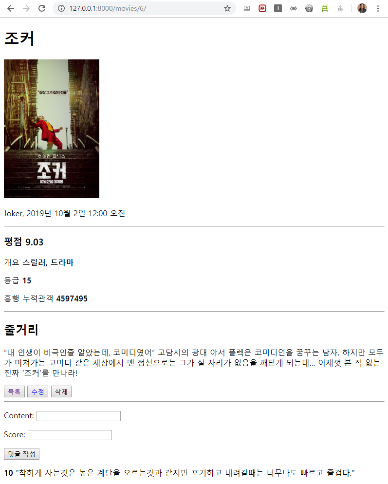

# 06 - 프레임워크 기반 웹 페이지 구현

## 1. 목표

* Python Web Framework를 통한 데이터 조작
* Object Relational Mapping에 대한 이해
* Template Variable을 활용한 Template 제작
* Static 파일 관리

## 2. 준비 사항

1. **(필수)** Python Web Framework - Django
2. **(필수)** Python Web Framework 사용을 위한 환경 설정
  * 가상환경 Python 3.7+

## 3. 요구 사항

1. **데이터베이스**

   * 영화에 대한 정보는 아래와 같이 저장됩니다.

   * 모델명 : Movie

     | **필드명**  | **자료형** | **설명**      |
     | ----------- | ---------- | ------------- |
     | title       | String     | 영화명        |
     | title_en    | String     | 영화명(영문)  |
     | audience    | Integer    | 누적 관객수   |
     | open_date   | Date       | 개봉일        |
     | genre       | String     | 장르          |
     | watch_grade | String     | 관람등급      |
     | score       | Float      | 평점          |
     | poster_url  | Text       | 포스터 이미지 |
     | description | Text       | 영화 소개     |

   * 개별 영화에 대한 한줄평은 아래와 같이 저장됩니다.

   * 모델명 : Review

     | **필드명** | **자료형** | **설명**                   |
     | ---------- | ---------- | -------------------------- |
     | content    | String     | 한줄평(평가 내용)          |
     | score      | Integer    | 평점                       |
     | movie_id   | Integer    | Movie의 Primary Key(id 값) |

   * `models.py`

     ```python
     from django.db import models
     
     class Movie(models.Model):
         title = models.CharField(max_length=40)
         title_en = models.CharField(max_length=40)
         audience = models.IntegerField() 
         open_date = models.DateTimeField()
         genre = models.CharField(max_length=40)
         watch_grade = models.CharField(max_length=20)
         score = models.FloatField()
         poster_url = models.TextField()
         description = models.TextField()
     
     class Review(models.Model):
         movie = models.ForeignKey(Movie, on_delete=models.CASCADE)
         content = models.CharField(max_length=50)
         score = models.IntegerField()
     ```

   * `forms.py`

     ```python
     from django import forms
     from .models import Movie, Review
     
     class MovieForm(forms.ModelForm):
         class Meta:
             model = Movie
             fields = '__all__'
     
     class ReviewForm(forms.ModelForm):
         class Meta:
             model = Review
             exclude = ('movie',)
     ```

     

2. **페이지**

   * 코드

     * `./urls.py`
   
       ```python
       from django.contrib import admin
       from django.urls import path, include
    
       urlpatterns = [
        path('admin/', admin.site.urls),
           path('movies/', include('movies.urls'))
    ]
       ```

     * `movies/urls.py`
   
       ```python
       from django.urls import path
       from . import views
       
       app_name = 'movies'
       urlpatterns = [
           path('', views.index, name='index'),
           path('create/', views.create, name='create'),
           path('<int:pk>/', views.detail, name='detail'),
           path('<int:pk>/update/', views.update, name='update'),
           path('<int:pk>/delete/', views.delete, name='delete'),
           path('<int:pk>/reviews/', views.review_create, name='review_create'),
       ]
       ```
   
     * `views.py`
   
    ```python
       from django.shortcuts import render, redirect, get_object_or_404
       from django.views.decorators.http import require_POST
       from .models import Movie
       from .forms import MovieForm, ReviewForm
       
       # 1. 영화 목록
       def index(request):
           movies = Movie.objects.all()
           context = {
               'movies': movies
           }
           return render(request, 'movies/index.html', context)
       
       # 2. 영화 정보 생성 Form, 3. 영화 정보 생성
       def create(request):
           if request.method == 'POST':
               movie_form = MovieForm(request.POST)
               if movie_form.is_valid():
                   movie = movie_form.save()
                   return redirect('movies:detail', movie.pk)
           else:
               movie_form = MovieForm()
           context = {
               'movie_form': movie_form
           }
           return render(request, 'movies/form.html', context)
       
       # 4. 영화 정보 조회
       def detail(request, pk):
           movie = get_object_or_404(Movie, pk=pk)
           review_form = ReviewForm()
           context = {
               'movie': movie,
               'review_form': review_form
           }
           return render(request, 'movies/detail.html', context)
       
       # 5. 영화 정보 수정 Form, 6. 영화 정보 수정
       def update(request, pk):
           movie = get_object_or_404(Movie, pk=pk)
           if request.method == 'POST':
               movie_form = MovieForm(request.POST, instance=movie)
               if movie_form.is_valid():
                   movie = movie_form.save()
                   return redirect('movies:detail', movie.pk)
           else:
               movie_form = MovieForm(instance=movie)
           context = {
               'movie_form': movie_form
           }
           return render(request, 'movies/form.html', context)
       
       # 7. 영화 정보 삭제
       @require_POST
       def delete(request, pk):
           movie = get_object_or_404(Movie, pk=pk)
           movie.delete()
           return redirect('movies:index')
       
       # 8. 영화 한줄평 생성
       @require_POST
       def review_create(request, pk):
           movie = get_object_or_404(Movie, pk=pk)
           review_form = ReviewForm(request.POST)
           if review_form.is_valid():
               review = review_form.save(commit=False)
               review.movie = movie
               review.save()
           return redirect('movies:detail', movie.pk)
       ```
   
       
   
   1. 영화 목록
   
      1. **(필수)** 요청 URL은 `/movies/` 입니다. URL은 적절한 name을 가집니다.
   
      2. **(필수)** 데이터베이스에 존재하는 모든 영화의 목록이 표시 되며, 각 영화의 `title` , `score` 가 표시됩니다.
   
      3. **(필수)** `title` 을 클릭 시, 해당 `영화 정보 조회` 페이지로 이동합니다.
   
      4. **(필수)** 영화 목록 최상단에 `새 영화 등록` 링크가 있으며, 클릭 시 `영화 정보 생성 Form` 페이지로 이동합니다.
   
      5. **(필수)** 목록 상단에 영화와 관련한 이미지를 삽입합니다. 해당 이미지는 반드시 서버에 저장된 이미지를 사용합니다.
   
      6. 코드
   
         * `base.html`
   
             ```html
             <!DOCTYPE html>
             <html lang="ko">
             <head>
               <meta charset="UTF-8">
               <meta name="viewport" content="width=device-width, initial-scale=1.0">
               <meta http-equiv="X-UA-Compatible" content="ie=edge">
               <title>영화 평점 페이지</title>
             </head>
             <body>
               
               
              </body>
              </html>
             ```
   
         * `index.html`
   
             ```html
             
             
             
               <a href="">새 영화 등록</a>
               <br>
               
               
                 <h3><a href=""><b>{{ movie.title }}</b></a> {{ movie.score }}</h3>
               
             
             ```
   
   2. 영화 정보 생성 Form
   
      1. **(필수)** 요청 URL은 `GET` `/movies/create/` 입니다. URL은 적절한 name을 가집니다.
   
      2. **(필수)** 영화 정보를 작성할 수 있는 Form이 표시 되며, 다음과 같은 input들을 가지고 있습니다.
   
         | **필드명** | **HTML Tag** | **Type** |
         | ---------- | ------------ | -------- |
         | title       | input | text     |
         | title_en    | input | text |
         | audience    | input | number |
         | open_date   | input  | date     |
         | genre       | input | text       |
         | watch_grade | input | text |
         | score       | input | number     |
         | poster_url  | input | text |
         | description | textarea | 없음    |
   
      3. **(필수)** Form에 작성된 정보는 Form Submit 버튼 클릭 시 `영화 정보 생성` 페이지로 생성 요청(request)과 함께 전송됩니다.
   
      4. html 코드
   
         * `form.html`
   
           ```html
           
           
           <h1>영화 등록 페이지</h1>
           <form action="" method="POST">
             
             {{ movie_form.as_p }}
             <input type="submit" value="영화 등록하기">
           </form>
           
           ```
   
           * `form.html`은 `3. 영화 정보 생성`, `5. 영화 정보 수정 Form`, `6. 영화 정보 수정`에서도 사용한다.
   
   3. 영화 정보 생성
   
      1. **(필수)** 요청 URL은 `POST` `/movies/create/` 입니다. URL은 적절한 name을 가집니다.
      2. **(필수)** 이전 페이지로부터 전송 받은 데이터를 검증한 후 데이터베이스에 저장합니다.
      3. **(필수)** 검증에 실패한 경우 `영화 정보 생성 Form` 으로 Redirect 합니다.
      4. **(필수)** 해당 페이지에서 저장한 영화 정보를 조회하는 `영화 정보 조회` 페이지로 Redirect 합니다.
   
   4. 영화 정보 조회
   
      1. **(필수)** 요청 URL은 `/movies/1/ `, `/movies/2/` 등 이며, 동적으로 할당되는 부분이 존재합니다. 동적으로 할당되는 부분에는 데이터베이스에 저장된 영화 정보의 Primary Key가 들어갑니다. URL은 적절한 name을 가집니다.
   
      2. **(필수)** 해당 Primary Key를 가진 영화의 **모든 정보**가 표시됩니다.
   
      3. **(필수)** 영화 정보의 최하단에는 `목록` , `수정` , `삭제` 링크가 있으며, 클릭 시 각각 `영화 목록` , `해당 영화 정보 수정 Form `, 해당 `영화 정보 삭제` 페이지로 이동합니다.
   
      4. html 코드
   
         * `detail.html`
   
           ```html
           
           
           <h1>{{ movie.title }}</h1>
           
           <p>{{ movie.title_en }}, {{ movie.open_date }}</p>
           <hr>
           <h3>평점 <b>{{ movie.score }}</b></h3>
           <p>개요 <b>{{ movie.genre }}</b></p>
           <p>등급 <b>{{ movie.watch_grade }}</b></p>
           <p>흥행 누적관객 <b>{{ movie.audience }}</b></p>
           <hr>
           <h2>줄거리</h2>
           <p>{{ movie.description }}</p>
           <button><a href="" style="text-decoration: none;">목록</a></button>
           <button><a href="" style="text-decoration: none;">수정</a></button>
           <form action="" method="POST" style="display: inline;">
             
             <input type="submit" value="삭제">
           </form>
           <hr>
           <form action="" method="POST">
             
             {{ review_form.as_p}}
             <input type="submit" value="댓글 작성">
           </form>
           
           <p><b>{{ review.score }}</b> "{{ review.content }}"</p>
           
           <p>작성된 댓글이 없습니다.</p>
           
           
           ```
   
   5. 영화 정보 수정 Form
   
      1. **(필수)** 요청 URL은 `GET` `/movies/1/update/ `, `/movies/2/update/` 등 이며, 동적으로 할당되는 부분이 존재합니다. 동적으로 할당되는 부분에는 데이터베이스에 저장된 영화 정보의 Primary Key가 들어갑니다. URL은 적절한 name을 가집니다.
      2. **(필수)** 해당 Primary Key를 가진 영화 정보를 수정할 수 있는 Form이 표시 되며, `영화 정보 생성 Form`과 동일한 input을 가지고 있습니다.
      3. **(필수)** Form에 작성된 정보는 Form Submit 버튼 클릭 시 `영화 정보 수정` 페이지로 수정 요청(request)과 함께 전송됩니다.
   
   6. 영화 정보 수정
   
      1. **(필수)** 요청 URL은 `POST` `/movies/1/update/` , `/movies/2/update/` 등 이며, 동적으로 할당되는 부분이 존재합니다. 동적으로 할당되는 부분에는 데이터베이스에 저장된 영화 정보의 Primary Key가 들어갑니다. URL은 적절한 name을 가집니다.
      2. **(필수)** 해당 Primary Key를 가진 영화 정보를 이전 페이지로부터 전송 받은 데이터로 변경하여 데이터베이스에 저장합니다.
      3. **(필수)** 해당 페이지에서 수정한 영화 정보를 조회하는 `영화 정보 조회` 페이지로 Redirect 합니다.
   
   7. 영화 정보 삭제
   
      1. **(필수)** 요청 URL은 `/movies/1/delete/` , `/movies/2/delete/` 등 이며, 동적으로 할당되는 부분이 존재합니다. 동적으로 할당되는 부분에는 데이터베이스에 저장된 영화 정보의 Primary Key가 들어갑니다. URL은 적절한 name을 가집니다.
      2. **(필수)** 해당 Primary Key를 가진 영화 정보를 데이터베이스에서 삭제합니다.
      3. **(필수)** `영화 정보 목록` 페이지로 Redirect 합니다.
   
   8. 영화 한줄평 생성
   
      1. **(필수)** 한줄평 작성을 위한 Form은 `영화 정보 조회` 페이지에서 제공됩니다.
      2. **(필수)** 요청 URL은 `POST` `movies/1/reviews/` , `movies/2/reviews/` 이며, 동적으로 할당되는 부분이 존재합니다. 동적으로 할당되는 부분에는 데이터베이스에 저장된 영화 정보의 Primary Key가 들어갑니다. URL은 적절한 name을 가집니다.
      3. **(필수)** `영화 정보 조회` 페이지로 Redirect 합니다.

## 4. 결과 예시

작성한 프로젝트 파일을 가상환경 폴더를 제외하고 `pjt06` 디렉토리에 위치하도록 합니다.

결과물은 `README.md`에 활용하였을 내용과 함께 포함되어 있습니다.

### 영화 목록 화면


### 영화 조회 화면



